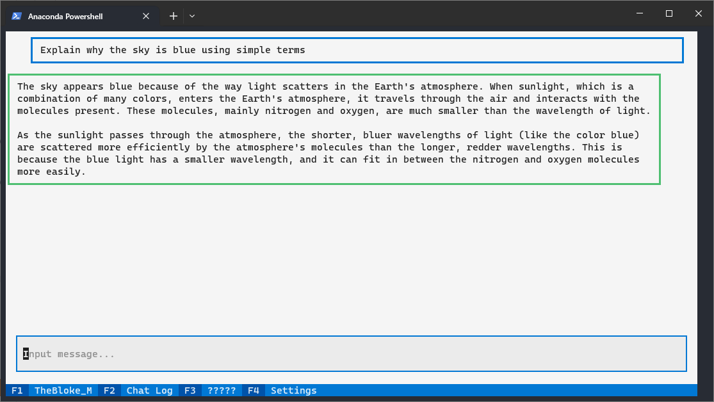

## TerminaLLM  

Another frontend for local LLMs  
Powered by [Textual](https://textual.textualize.io/)  

### Install and run:  
```
# Install Torch first, refer to https://pytorch.org/
pip install torch --index-url https://download.pytorch.org/whl/cu121
# Clone and install dependencies
git clone https://github.com/sanguchi/TerminaLLM  
cd TerminaLLM  
pip install -r requirements.txt  
python main.py  
```

_Note:  models should be folders inside /models_


#### Loaders:  
- [x] Transformers  
- [x] ExLlama  
- [x] ExLlamaV2  
- [x] AutoAWQ  
- [ ] AutoGPTQ  
- [ ] llama.cpp  
- [ ] ???  

#### Frontends:  
- [x] Single line Input  
- [x] Multiline TextArea for LLM colab editing  
- [x] Side by Side Multiline TextArea and Output
- [x] Chat style  
- [ ] LLM Assisted code editor  
- [ ] Tree branch conversation exploring  

#### TODO:  
- Template settings
- Frontend settings
- Loader settings
- App settings
